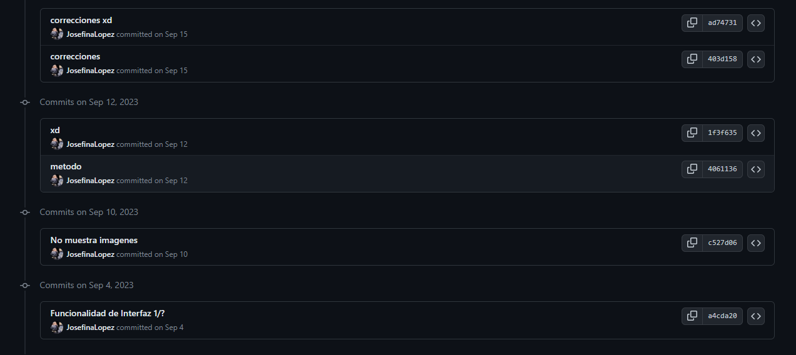

# Project 3 - Pizza 

## Descripcion del Proyecto
Este proyecto consiste en una aplicación web para gestionar pedidos en línea para un restaurante de pizza llamado "Pinocchio's Pizza & Subs" en Cambridge. Los usuarios pueden explorar el menú, agregar artículos a su carrito de compras y realizar pedidos. Los administradores del restaurante pueden gestionar el menú, ver las órdenes recibidas y marcarlas como completadas.

## Login y Register
Tanto el login como register permite registrar a un usuario deacuerdo a sus credenciales y reedirigirlo
a la pagina principal

## Menu
A como puede observar este es el diseño de la pagina de inicio , en donde se muestra de 
forma destacada el menu de la pizzeria.

## Detalle Prodocuto
Algo que no debe faltar en una aplicacion de ordenes, son los elementos toppings y demas 
especificaciones para una orden a gusto del cliente, es por ello que cree esta vista.

## Carrito
Luego de haber el cliente especificado la orden a su gusto, podra agregarla a un carrito que 
guardara sus ordenes hasta que quiera finalizarla.

## Descripcion de Orden
Se le pedira al cliente que agregue su direccion, en caso que ya la haya agregado esta no se modificara.

Luego eso reedigira a la pagina de orden en donde podra observar todo lo seleccionado a su gusto para
enviarla al administrador de ordenes.

Luego de Finalizar la orden le saldra esto

## Toque Personal
Se añadió la funcionalidad de permitir a los administradores marcar las órdenes como completadas y permitir a los usuarios ver el estado de sus órdenes. Además, se implementó la opción de que los usuarios puedan ver el estado de sus órdenes pendientes o completadas.

Adjunto imagenes.
Vista del estado de orden  que ve el cliente.

Vista de Estado y ordenes que ve el admin, en donde puede confirmar una orden como completada

## Notas
> Usuario Admin: Josefina Lopez Contraseña : 070918
> Usuario Cliente: Ariel132 Contraseña: 123
> Estuve intentando manejar actualizacion del servidor en tiempo real con fech de js, no lo hice lo mejor, pero si lo mejor que pude hasta el momento.
> Me dio conflictos el repo al hacerle git force :'v , pero adjunto prueba de que yo he hecho todo esto

### Web Programming with Python and JavaScript
